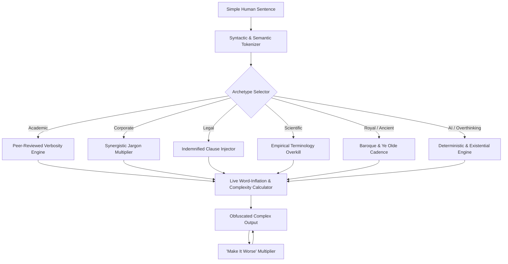

# Overcomplicator 📜🎯

> *"Why express a thought simply when you can say it with peer-reviewed verbosity, zero clarity, and maximum syllables?"*

[](https://overcomplicator.vercel.app/)

🌐 **Live Application**: [https://overcomplicator.vercel.app/](https://overcomplicator.vercel.app/)

---

## Basic Details

### Team Name: VoidCrypt

### Team Members
- **Team Lead**: Abhinav.P.S - SNM Institute of Management and Technology
- **Member 2**: Indrajith P.V - SNM Institute of Management and Technology

---

### Project Description
**Overcomplicator** is a humorous, intentionally useless web application that transforms simple everyday sentences into hilariously convoluted, pseudo-intellectual nonsense across 8 distinct archetypes while strictly preserving the underlying meaning.

---

### The Problem (that doesn't exist)
In modern human communication, everyday speech is tragically efficient, accessible, and understandable. 
When people utter concise phrases like *"I need to sleep"* or *"Let's eat lunch"*, they cruelly deprive society of corporate synergies, peer-reviewed verbosity, indemnification clauses, and existential dread. Why communicate effectively when you can sound unnecessarily important and confuse everyone in the room?

---

### The Solution (that nobody asked for)
We built an overengineered lexical obfuscation platform that:
- **8 Complication Archetypes**: Transforms text into Academic, Corporate, Legal, Scientific, Royal, Ancient, Robotic AI, and Overthinking modes.
- **"Make It Worse" Recursive Engine**: A button dedicated to escalating the complexity level arbitrarily until sentences collapse under their own intellectual weight.
- **🔄 Reverse Workspace (Plain English Decrypter)**: Decodes corporate jargon back into plain human English.
- **📊 Real-Time Word Inflation Analytics**: Displays syllable growth, word count inflation percentage, and reading difficulty in real time.
- **Confetti & One-Click Copy**: Celebrates every wasteful syllable generated.

---

## Technical Details

### Technologies/Components Used

**For Software:**
- **Languages**: JavaScript (ES6+), HTML5, CSS3
- **Frameworks**: React 19, Vite
- **Styling**: Tailwind CSS v4
- **Libraries**: Lucide React (Icons), Canvas Confetti
- **Deployment & Tooling**: Vercel, Git, GitHub

---

### Implementation

#### Installation
```bash
git clone https://github.com/abhinav4001/useless-overcomplicator.git
cd useless-overcomplicator
npm install
```

#### Run Locally
```bash
npm run dev
```

#### Build for Production
```bash
npm run build
```

---

## Project Documentation

### Workflow & Architecture


### Features & Modes Breakdown
| Mode | Archetype | Example Input | Convoluted Output |
| :--- | :--- | :--- | :--- |
| 🎓 **Academic** | Peer-Reviewed Verbosity | *"I am tired."* | *"The subject exhibits acute psycho-physiological exhaustion requiring recumbent restorative dormancy."* |
| 💼 **Corporate** | Synergistic Overhead | *"Let's talk."* | *"Let us proactively synchronize bandwidth to facilitate bilateral actionable dialogue."* |
| ⚖️ **Legal** | Indemnified Jargon | *"I agree."* | *"The undersigned hereby irrevocably covenants and accedes unconditionally to the terms."* |
| 🧪 **Scientific** | Empirical Overkill | *"Water is cold."* | *"The dihydrogen monoxide exhibits an acutely depressed thermal kinetic energy state."* |
| 👑 **Royal** | Sovereign Proclamation | *"Be quiet."* | *"By sovereign decree, silence shall forthwith descend upon all subjects present."* |
| 📜 **Ancient** | Ye Olde Cadence | *"Where are you?"* | *"Whither hath thy mortal vessel wandered in this fleeting epoch?"* |
| 🤖 **AI** | Deterministic Output | *"I forgot."* | *"Query execution terminated: cached memory index returned null pointer exception."* |
| 🧠 **Overthinking**| Existential Spiral | *"I want tea."* | *"Does the temporary alleviation of thirst justify the existential absurdity of tea preparation?"* |

---

## Project Demo

### Video / Presentation Link
- **Demo Video**: [Google Drive Demo Video](https://drive.google.com/drive/folders/1fS_rO102RUMnCVpMOuPzrU9iXdb2Sqj6?usp=sharing)
- **Live Web Application**: [https://overcomplicator.vercel.app/](https://overcomplicator.vercel.app/)

---

## Team Contributions

- **Abhinav.P.S**: Core lexical translation engine architecture, dictionary generation across 8 modes, reactive state machine, Tailwind v4 design system, and Vercel CI/CD pipeline.
- **Indrajith P.V**: Reverse translation logic, real-time statistical metrics (syllable & inflation calculator), UI testing, edge-case validation, and documentation.

---

Made with ❤️ at TinkerHub Useless Projects 


